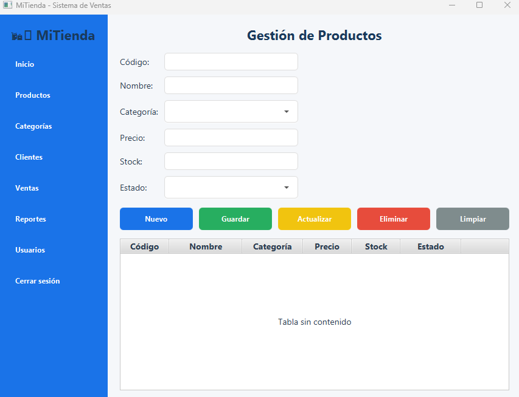

#  Proyecto 17 - Sistema de Gestión de Productos

## Descripción
Este proyecto es un sistema de escritorio desarrollado en **JavaFX** que simula un **dashboard de gestión de productos** con acceso mediante login.  
Incluye un menú lateral con diferentes módulos y un formulario completo para administrar productos con operaciones CRUD.

---

## 📸 Captura del diseño


---

##  Tecnologías utilizadas
- **JavaFX** → para la interfaz gráfica.
- **CSS** → para estilos personalizados y diseño moderno.
- **FXML** → para la definición estructurada de las vistas.

---

##  Funcionalidades implementadas
- **Login funcional** con validación de usuario, contraseña y rol.
- **Menú lateral** con las opciones:
  - Inicio
  - Productos
  - Categorías
  - Clientes
  - Ventas
  - Reportes
  - Usuarios
  - Cerrar sesión
- **Gestión de productos (CRUD):**
  - Nuevo → limpia los campos para ingresar un producto nuevo.
  - Guardar → valida los datos y agrega el producto a la tabla.
  - Actualizar → permite modificar un producto seleccionado.
  - Eliminar → elimina un producto de la tabla con confirmación.
  - Limpiar → borra los campos del formulario.
- **Tabla de productos** con las columnas:
  - Código
  - Nombre
  - Categoría
  - Precio
  - Stock
  - Estado

---

##  Estructura de carpetas
Proyecto17/

├── src/main/java/proyecto17/proyecto17/

│   ├── Main.java

│   ├── LoginController.java

│   ├── MenuController.java

│   ├── Producto.java

├── src/main/resources/proyecto17/proyecto17/

│   ├── Login.fxml

│   ├── Menu.fxml

│   ├── styles.css

└── README.md


##  Instrucciones de ejecución
1. Clonar el repositorio:
   ```bash
   git clone https://github.com/NicolayBarreno2134/Tarea-17-POO
2. Abrir el proyecto en IntelliJ IDEA o cualquier IDE compatible con Maven/Gradle.

3. Asegurarse de tener configuradas las librerías de JavaFX.

4. Ejecutar la clase Main.java para iniciar el sistema.

5. Ingresar con las credenciales de prueba:

Usuario: admin

Contraseña: 1234

Rol: Administrador

